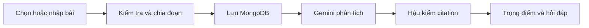

# SLIDE 01 — TAPHOAMMO

## Trợ lý bắt kịp bài học có kiểm chứng nguồn

**Biến transcript dài thành phần kiến thức cần đọc trước**

Nhóm thực hiện:

**Nguyễn Đức Anh** · Phan Văn Hiếu · Nguyễn Huy Tỏa · Tạ Long Khánh · Vũ Đăng Huy

---

# SLIDE 02 — Transcript dài chưa cho học viên biết nên đọc gì trước

## Vấn đề của người học

- Nghỉ một buổi nhưng phải đọc toàn bộ transcript.
- Nội dung quan trọng bị trộn với chào hỏi, chuyển ý và hoạt động lớp.
- Đọc hết tốn thời gian; đọc lướt dễ bỏ sót kiến thức nền.
- Bản tóm tắt AI tự do khó kiểm chứng và có thể thêm thông tin ngoài bài.

| Dữ liệu khảo sát | Kết quả |
|---|---:|
| Buổi học | **6** |
| Đoạn transcript | **700** |
| Đoạn hoạt động lớp | **55** |
| Đoạn có tín hiệu “không nghe rõ” | **103** |

---

# SLIDE 03 — taphoammo tạo bản đồ đọc ưu tiên, không chỉ tóm tắt

## Giá trị cốt lõi

- Chỉ xử lý **một buổi học mỗi lần**.
- Chọn **2–5 trọng điểm** cần đọc trước.
- Mỗi trọng điểm có **mã đoạn nguồn** để kiểm chứng.
- Chỉ đánh dấu liên quan quiz khi có quiz cũ để đối chiếu.
- Cho phép hỏi đáp trong phạm vi transcript đang mở.
- Không đủ căn cứ thì **từ chối**, không suy đoán.

> **Đọc gì trước · Vì sao cần đọc · Kiểm chứng ở đâu**

---

# SLIDE 04 — Một luồng xuyên suốt từ dữ liệu đến kết quả

## Cách hệ thống hoạt động

1. Nhập transcript bằng TXT, Markdown, JSON hoặc chọn bài demo.
2. Chuẩn hóa nội dung và sinh mã đoạn ổn định.
3. Tạo fingerprint cho đúng phiên bản transcript và quiz.
4. Gemini trả kết quả theo JSON Schema cố định.
5. Backend kiểm tra số lượng, trùng lặp và citation trước khi lưu.

**Transcript hoặc quiz thay đổi → fingerprint thay đổi → không dùng lại kết quả AI cũ.**

---

# SLIDE 05 — Trọng điểm được chọn bằng tiêu chí học tập rõ ràng

## Nội dung được ưu tiên

- Khái niệm hoặc kỹ thuật được giải thích.
- Quan hệ nguyên nhân – kết quả.
- Quy trình hoặc chuỗi bước.
- Ví dụ thực sự giúp hiểu bài.
- Nội dung được giảng viên nhấn mạnh.

## Nội dung bị loại

- Chào hỏi, chuyển ý và hành chính.
- Hoạt động lớp không tạo kiến thức mới.
- Trao đổi ngoài chuyên môn.
- Nội dung lặp hoặc phần đệm.

**Gemini dùng độ ngẫu nhiên thấp, trả 2–5 mục và mỗi mục bắt buộc có citation hợp lệ.**

---

# SLIDE 06 — AI trả lời trọng tâm nhờ context hẹp và guardrail

## Pipeline hỏi đáp

**Câu hỏi → Retrieval → Tối đa 4 đoạn liên quan → Gemini → Hậu kiểm**

- Hỗ trợ tiếng Việt có dấu và không dấu.
- Loại từ dừng, ưu tiên từ khóa hiếm và cụm từ liên tiếp.
- Chỉ gửi các đoạn liên quan thay vì toàn bộ transcript.
- AI phải kết luận ngay, trả lời ngắn và dẫn nguồn.
- `supported=false` hoặc không còn citation hợp lệ → từ chối.

## Hỏi ngay tại phần bôi đen

- Backend xác minh phần chọn thuộc đúng đoạn nguồn.
- Câu trả lời xuất hiện ngay dưới đoạn, không chuyển sang trang khác.
- Có thể hỏi tiếp nhiều lượt trong cùng ngữ cảnh.
- Chat dài cuộn trong khung riêng.

---

# SLIDE 07 — Dữ liệu và AI đều có cơ chế vận hành an toàn

## Dữ liệu thật trong runtime

- MongoDB 8.0 chạy bằng Docker và lưu dữ liệu bền vững.
- Giữ nguyên **6 bài demo** từ data pack đã ẩn danh.
- Bài người dùng nhập có nhãn **Bạn thêm** và không ghi đè demo.
- Analysis được lưu theo fingerprint.

## Gemini API key pool

- Nhập nhiều key, mỗi dòng một key.
- Round-robin và tự chuyển slot khi hết quota.
- Key được mã hóa bằng Windows DPAPI.
- Không commit key; giao diện chỉ hiển thị key đã che.
- Non-streaming: không đưa câu trả lời dở dang ra giao diện.

---

# SLIDE 08 — Prototype chạy thật và có đường phát triển rõ ràng

## Kết quả hiện tại

- **32/32 unit test đạt**.
- Golden set gồm **20 tình huống**.
- Có kiểm thử câu đúng nguồn, câu mơ hồ, câu ngoài phạm vi và citation giả.
- Giao diện hoàn chỉnh: Tổng quan, Trọng điểm, Transcript và Hỏi AI.

## Hướng phát triển

- Hybrid retrieval: lexical + embedding.
- Semantic verifier cho từng mệnh đề và citation.
- Đăng nhập, phân quyền và dữ liệu riêng từng người dùng.
- Secret Manager và hạ tầng production đa nền tảng.

> **taphoammo không thay thế nguồn học; taphoammo dẫn người học đến đúng phần của nguồn học nhanh hơn.**
